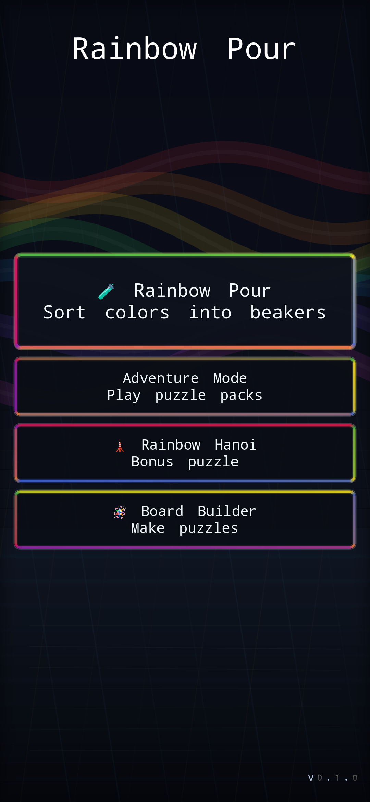
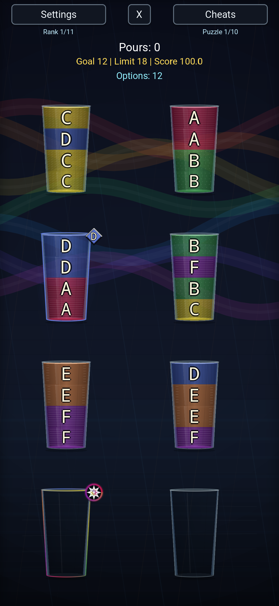
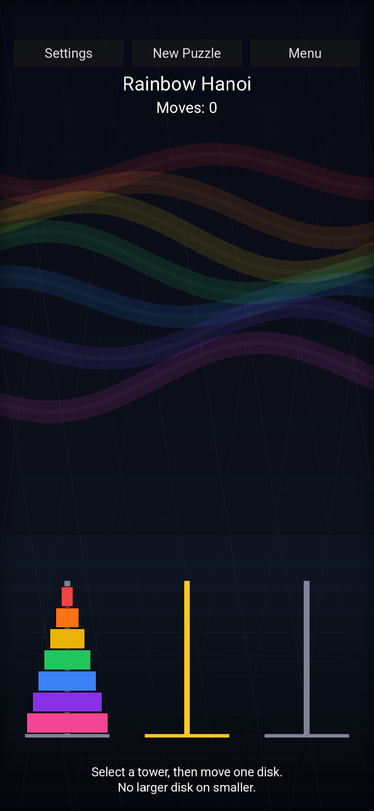
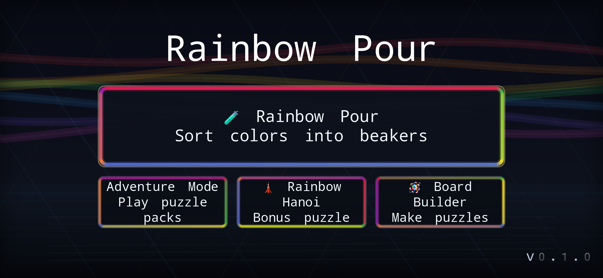
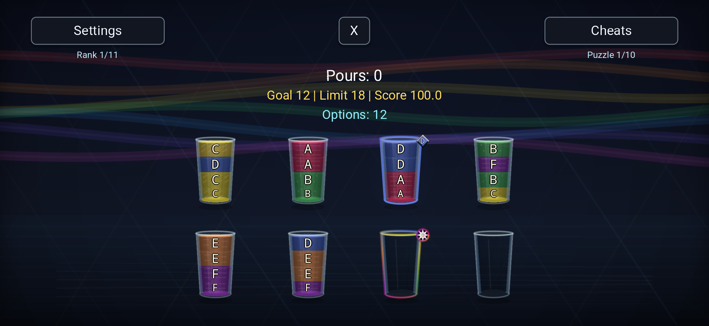
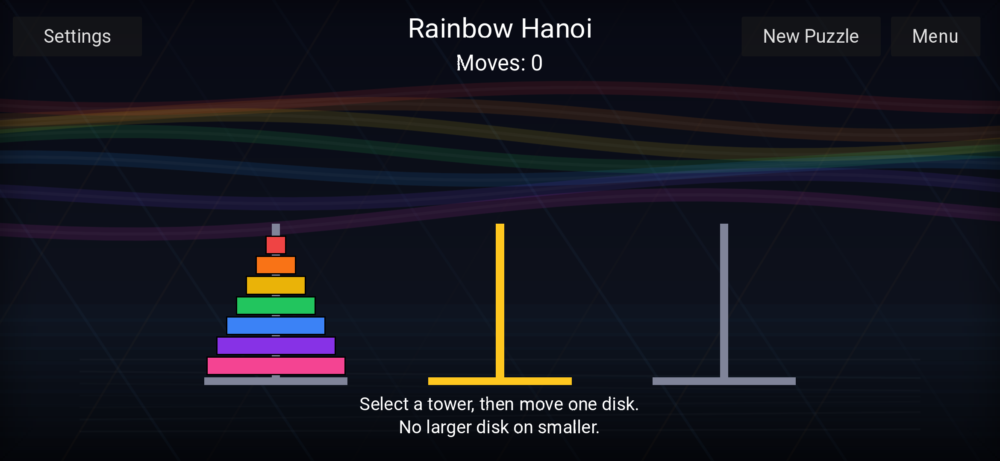
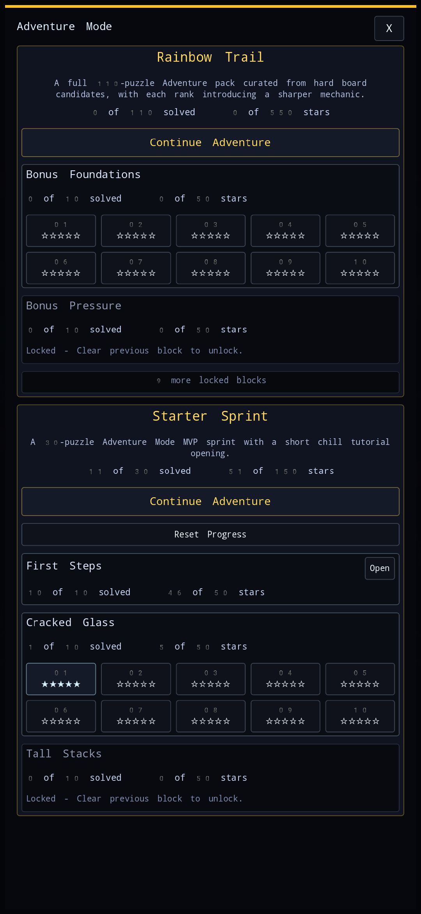
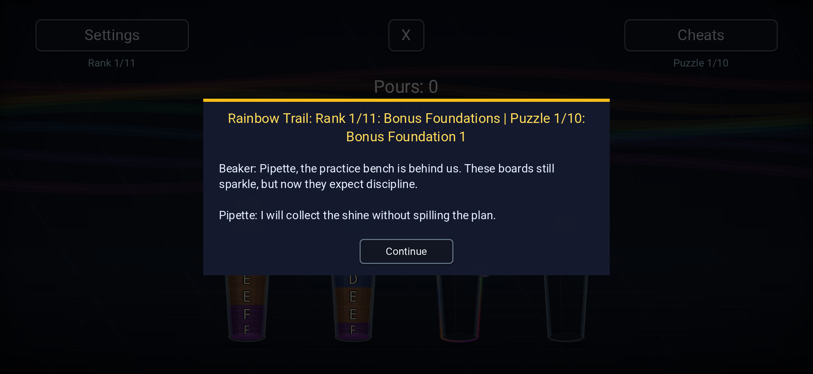
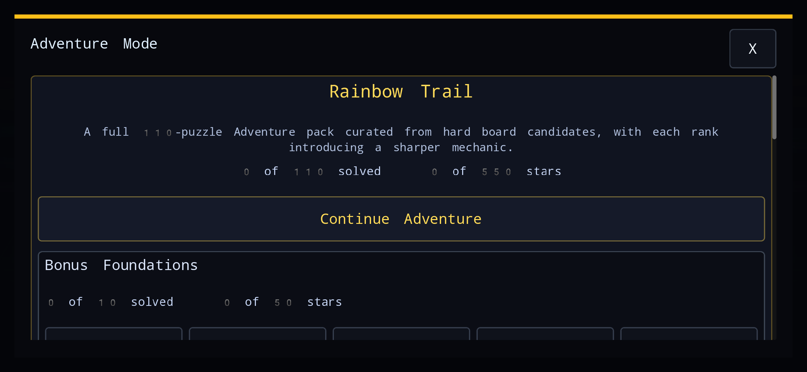

# Rainbow Pour

A colorful Godot 4.6 pour puzzle project with a bonus Rainbow Hanoi side mode.

## About

Rainbow Pour includes adjustable beaker capacity, difficulty settings, special beaker traits, scoring, chill mode, pipette-powered cheats, sound effects, loss conditions, and optimal-pour goal tracking.

## Screenshots

Portrait:

  
  
  

Landscape:

  
  
  

Adventure Mode:

  
  
  

## Getting Started

1. Install Godot 4.x from https://godotengine.org/
2. Open the project in Godot
3. Run the main scene

## Android

See [docs/ANDROID.md](docs/ANDROID.md) for building an APK and installing it on an Android phone.

## How to Play

Rainbow Pour:
- Click a beaker to select it, then click another beaker to pour.
- Pours are legal when the destination is empty or its top color matches.
- Sort each color into its own beaker to win. Cracked beakers must be empty at the end, and they shatter if filled with one color.
- Use cheats deliberately: undo/redo, extra beaker, stir, swap, and pipette transfer can all change the board. Chill mode removes score pressure and allows one use of each cheat, with redo available up to four times.
- Earn bonuses from special beakers such as tinted and prismatic beakers when their conditions are satisfied.

Rainbow Hanoi:
- Move disks from one tower to another.
- Only one disk can be moved at a time.
- A larger disk cannot be placed on top of a smaller disk.

## Project Structure

- `scenes/` - Game scenes
- `scripts/` - GDScript files
- `assets/` - Game assets (sprites, sounds, etc.)
